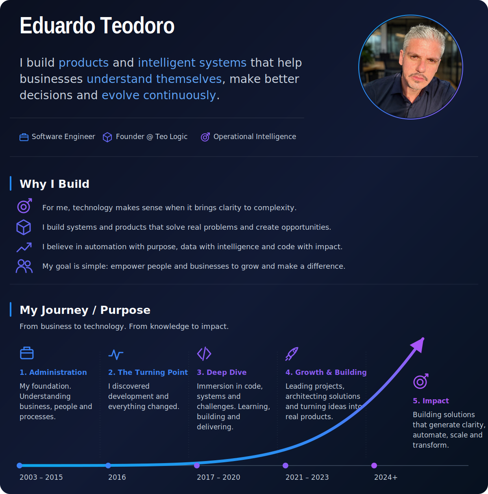

# Profile Engine

A deterministic TypeScript rendering engine that transforms structured profile data into composable SVG documents for GitHub profiles.

<p align="center">
    
</p>

## Why Profile Engine Exists

GitHub profile READMEs are usually maintained as static Markdown documents composed of badges, cards, statistics and manually edited sections.

Profile Engine explores a different approach.

Instead of treating the profile as a document that must be manually designed and maintained, it treats profile content as structured data and the final presentation as a generated artifact.

The result is a rendering pipeline in which content, validation, orchestration and visual composition have distinct responsibilities.

```text
Structured Content
       │
       ▼
   YAML Input
       │
       ▼
Load & Validate
       │
       ▼
    Models
       │
       ▼
 Profile Engine
       │
       ├── Hero Renderer
       ├── About Renderer
       └── Journey Renderer
       │
       ▼
Unified SVG Composition
       │
       ▼
   GitHub README
```

## How It Works

Profile data is defined in YAML files inside the `content/` directory.

Loaders read, validate and normalize that content into typed models.

The `Engine` orchestrates the generation pipeline and delegates visual rendering to specialized generators.

The current unified profile composition is built from three main SVG sections:

- **Hero** — identity, positioning, professional roles and profile photo.
- **About** — principles and motivations behind the work.
- **Journey** — a visual timeline representing professional evolution and purpose.

These sections are rendered independently and composed into a single SVG document by `profileSvg.ts`.

The generated SVG is then embedded in the final GitHub README.

## Architecture

Profile Engine follows a responsibility-oriented pipeline:

```text
content/
   │
   ▼
Loaders
   │
   ▼
Typed Models
   │
   ▼
Engine
   │
   ▼
Generators
   │
   ▼
SVG Composition
   │
   ▼
Generated Artifacts
   │
   ▼
README
```

### Core Responsibilities

**Content**

Stores profile information as structured YAML data.

**Loaders**

Read, validate and normalize source content.

**Models**

Define the TypeScript contracts used throughout the generation pipeline.

**Engine**

Acts as the central orchestrator. It loads configuration and content, coordinates generators and writes the final artifacts.

**Generators**

Transform typed models into Markdown or SVG output.

**SVG Composition**

Combines specialized visual sections into a unified profile document.

**Renderer**

Composes generated sections into the final README output.

## Project Structure

```text
profile-engine/
├── assets/
│   ├── generated/
│   └── profile.jpg
│
├── content/
│   ├── config.yml
│   ├── journey.yml
│   ├── profile.yml
│   ├── projects.yml
│   ├── social.yml
│   └── readme/
│
├── specification/
│   ├── ARCHITECTURE.md
│   └── README.md
│
├── src/
│   ├── components/
│   ├── constants/
│   ├── engine/
│   ├── generators/
│   ├── loaders/
│   ├── renderers/
│   ├── types/
│   └── utils/
│
├── package.json
└── tsconfig.json
```

## Structured Content

The engine currently reads its source data from five YAML files:

```text
content/
├── config.yml
├── profile.yml
├── journey.yml
├── projects.yml
└── social.yml
```

### `profile.yml`

Defines personal identity, positioning, profile photo, professional focus, technical expertise and other profile information.

### `journey.yml`

Defines the professional timeline used by the Journey renderer.

### `projects.yml`

Defines project information used by the projects generator.

### `social.yml`

Defines social and contact information.

### `config.yml`

Controls engine behavior, rendering configuration, SVG generation and feature flags.

## Generated Artifacts

Running the engine generates the final README and visual assets.

```text
output/
└── README.md

assets/generated/
├── profile.svg
├── hero.svg
├── about.svg
├── skills.svg
└── timeline.svg
```

The primary artifact in the current version is:

```text
assets/generated/profile.svg
```

It contains the unified visual composition used by the GitHub profile README.

## Getting Started

### Requirements

- Node.js 22 or newer
- npm

### Install Dependencies

```bash
npm install
```

### Validate Types

```bash
npm run typecheck
```

### Generate the Profile

```bash
npm run generate
```

The generated README will be written to:

```text
output/README.md
```

Generated SVG assets are written to:

```text
assets/generated/
```

### Build

```bash
npm run build
```

### Run the Compiled Engine

```bash
npm start
```

## Available Scripts

| Command | Description |
| --- | --- |
| `npm run dev` | Runs the engine in watch mode |
| `npm run build` | Builds the TypeScript source with tsup |
| `npm start` | Runs the compiled engine |
| `npm run generate` | Generates the profile directly from TypeScript |
| `npm run typecheck` | Runs TypeScript validation |
| `npm run lint` | Runs ESLint |
| `npm run format` | Formats the project with Prettier |

## Design Principles

Profile Engine is being developed around a small set of principles:

- **Content first** — profile information belongs to structured data, not presentation code.
- **Deterministic generation** — the same input should produce the same output.
- **Separation of responsibilities** — loading, validation, orchestration and rendering are independent concerns.
- **Composable rendering** — visual sections should be independently generated and composed.
- **Generated artifacts** — the final profile should be produced by the engine rather than manually maintained.
- **Visual quality** — generated output should be intentionally designed, not merely functional.

## Current Status

Profile Engine v2 is an active personal engineering project.

The current version implements:

- structured YAML content;
- typed loaders and models;
- content validation and normalization;
- centralized generation orchestration;
- specialized SVG renderers;
- unified SVG profile composition;
- deterministic README generation;
- configurable feature flags;
- generated visual assets.

The architecture is continuing to evolve as legacy Markdown-oriented generators are progressively consolidated around the unified visual composition model.

## License

This project is licensed under the MIT License.

---

Built by **Eduardo Teodoro** as an exploration of structured content, deterministic generation and programmatic visual composition.
